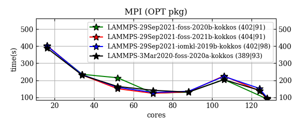
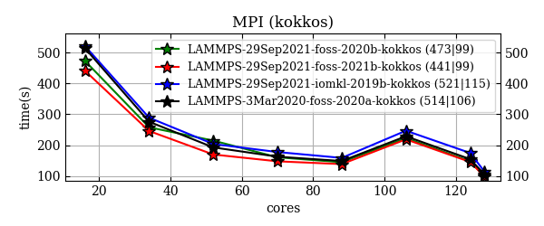
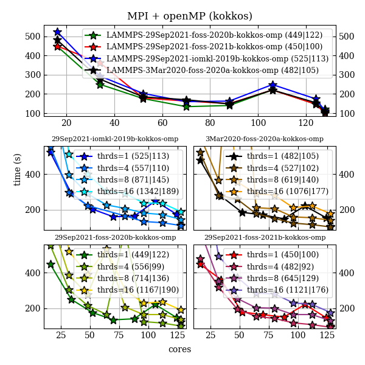
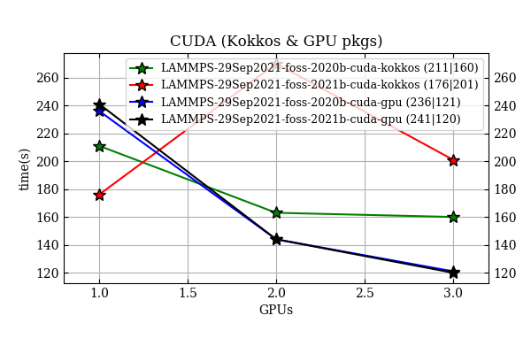

# LAMMPS for Sulis
versions: `29Sep2021` , `3Mar2020 (existing easyconfig)`.

## Building
This repository contains easyconfigs and an easyblock for building lammps on Sulis. Easyblock is taken from <a href=https://github.com/easybuilders/easybuild-easyblocks/pull/2213>here</a>.

In order to invoke the `foss*` builds, change directory to the one with the desired toolchain, e.g.,
```bash
cd ./29Sep2021/foss-2021b-cuda-11.4.1
```
and submit the installation script from there in the following way
```bash
sbatch --job=easyconfigs/LAMMPS-29Sep2021-foss-2021b-CUDA-11.4.1-kokkos.eb ../../scripts/localInstall-gnu-gpu.sh LAMMPS-29Sep2021-foss-2021b-CUDA-11.4.1-kokkos.eb
```
note that there are slightly different settings for -cpu and -gpu builds (added to the suffix):

| script                              | description               |
|-------------------------------------|---------------------------|
| `./scripts/localInstall-gnu-cpu.sh` | for multiprocessor build  |  
| `./scripts/localInstall-gnu-gpu.sh` | for GPU-accelerated build |

The `iomkl-2019b` installation is run by the batch script sitting inside the `./29Sep2021/iomkl-2019b` directory. That one has an additional line forcing to ignore SciPy-bundle build errors, and has also `INTEL_LICENSE_FILE` variable, which needs to be added manually. Neither scripts hold exact Sulis account information.

Finally, this is the local installations with all paths pointing inside the home directory, change it when necessary.


## Performance

### System of study
is a system of 55296 particles interacting via the Lennard-Jones potential.

### Avoid node exclusive usage
Due to not yet clear reasons, the exclusive usage at partial occupation of nodes gives worse performance on Sulis for newer `foss-*` toolchains. Therefore, one should run on as much cores as requested from Slurm. To see the effect, compare plots with  `*shared*` pattern in the file name inside the `./performance/pictures` directory, with ones without (i.e., exclusive node usage) the pattern. In the pictures below, legend contain numbers in the brackets, which is timing of the first (left-most) data point and the last (right-most) data point.

### OPT package
All toolchains perform similarly with when using `OPT` package.



compare with node-exclusive calculations


### OMP package and bare LAMMPS
`OMP_NUM_THREADS=4` gives a minor performance gain over the bare LAMMPS runs (providing equal total number CPUS). Moreover, It reduces some communication between MPI processes, which makes the calculations faster at `cores=~100`, where pure MPI calculations get slower.


### Kokkos (Serial backend)
I.e., MPI-only. It is slightly slower than `OPT` package.



### Kokkos (OpenMP backend)
Using threading in `Kokkos` makes the code slower with respect to MPI-only execution at lower core values in contrast to native `OMP` package of LAMMPS, though still faster than pure MPI when `cores=~100`. Also the claim that `OpenMP` backed with `OMP_NUM_THREADS=1` should be slower than the `Serial` above is not definitely visible.



### Cuda: GPU & Kokkos packages
Here we have an issue that the current `foss-2021b-CUDA-11.4.1-kokkos` build includes the `OpenMPI` which is not cuda-aware. Therefore, the corresponding runs do not benefit from multiple GPUS, although the single-GPU performance is good. As good as foss-2020b-CUDA-11.1.1-kokkos.



### Conclusions
 * Avoid exclusive when partially occupying a node.


 * `CPU` builds. I suggest `foss-2021b-kokkos-omp` (`OpenMP` `Kokkos` backend) is the best candidate. Corresponding easyconfig is here:

 `./29Sep2021/foss-2021b/easyconfigs/LAMMPS-29Sep2021-foss-2021b-kokkos-omp.eb`

 ignore the `LAMMPS-29Sep2021-foss-2021b-kokkos.eb` in the same directory (for Serial `Kokkos` backend).

 * `GPU` builds. Probably `foss-2020b-CUDA-11.1.1-kokkos`  (which is `fosscuda-2020b` in EB notations) is a better candidate for central installation due to good single GPU performance and support of multiple GPUs. Note, that it was slightly slower than `foss-2021b-CUDA-11.4.1-kokkos` when running with exclusive node usage, while the tests above show a similar perfromamce. In addition, all packages can be built with this toolchain (`VTK` has problems with `foss-2021b`). Easyconfig:

 `./29Sep2021/fosscuda-2020b/easyconfigs/LAMMPS-29Sep2021-fosscuda-2020b-kokkos.eb`

 ignore the `LAMMPS-29Sep2021-fosscuda-2020b-gpu.eb` in the same directory (which is for `GPU` package build instead of `Kokkos`).

The setup above misses only `GPU` package (not compatible with `Kokkos` in easyblock).
