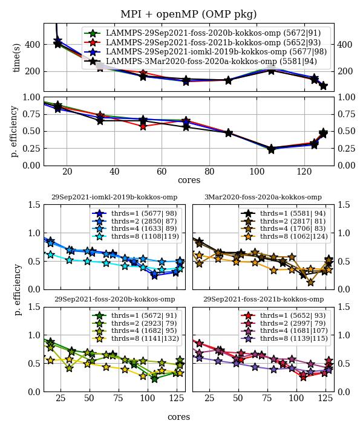
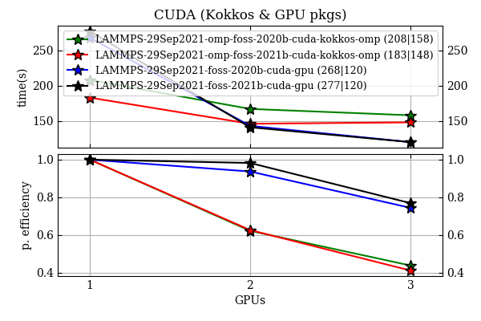

# LAMMPS for Sulis
versions: `29Sep2021` , `3Mar2020 (existing easyconfig)`.

## Building
This repository contains easyconfigs and an easyblock for building lammps on Sulis. Easyblock is taken from <a href=https://github.com/easybuilders/easybuild-easyblocks/pull/2213>here</a>.

In order to invoke the `foss*` builds, change directory to the one with the desired toolchain, e.g.,
```bash
cd ./29Sep2021/foss-2021b-cuda-11.4.1
```
and submit the installation script from there in the following way
```bash
sbatch --job=easyconfigs/LAMMPS-29Sep2021-foss-2021b-CUDA-11.4.1-kokkos-omp.eb ../../scripts/localInstall-gnu-gpu.sh LAMMPS-29Sep2021-foss-2021b-CUDA-11.4.1-kokkos-omp.eb
```

note that there are slightly different settings for -cpu and -gpu builds (added to the suffix):

| script                              | description               |
|-------------------------------------|---------------------------|
| `./scripts/localInstall-gnu-cpu.sh` | for multiprocessor build  |  
| `./scripts/localInstall-gnu-gpu.sh` | for GPU-accelerated build |

The `iomkl-2019b` installation is run by the batch script sitting inside the `./29Sep2021/iomkl-2019b` directory. That one has an additional line forcing to ignore SciPy-bundle build errors, and has also `INTEL_LICENSE_FILE` variable, which needs to be added manually. Neither scripts hold exact Sulis account information.

Finally, this is the local installations with all paths pointing inside the home directory, change it when necessary.


## Performance

### Setup
The test system consist of 55296 particles interacting via the Lennard-Jones potential. In the pictures below, legends contain numbers in brackets, which are `(timing for the first (left-most) data point | timing for the last (right-most) data point)`, all in seconds. For CPU usage, the last one is more conclusive because there is no interference with other jobs on the same node. In pure MPI and in runs with single openMP thread per MPI task the number of MPI tasks is equal to the number of CPU cores allocated for a job. When using a larger number of threads, the number of MPI tasks can be evaluated as number of cores for a chosen data point divided the number of OpenMP threads. We also estimate the parallel efficiency (`p. efficiency` on plots) as `T[1]/(N T[N])` where `T[x]` is timing when running on `x` CPUs.

### Avoid node exclusive usage at partial occupation
The exclusive usage at *partial* occupation of CPU-nodes gives a worse performance on Sulis for newer `foss-*` toolchains. This happens, most likely, due to a different way of allocating MPI ranks to sockets. Therefore, one should run on as much cores as requested from Slurm. To see the effect, check out first to a previous commit, e.g. `aacefb6f42f39cd0bebe7fe4e4ddff8055d3136d`.

### Bare LAMMPS
foss-2020b and foss-2021b show slightly better performance.


### OPT package
Similar result gives `OPT` package, although all calculations are faster overall.


### Kokkos (Serial backend)
I.e., MPI-only. It gives similar timing as bare LAMMPS.


### OMP
`OMP_NUM_THREADS=2` gives around 20% performance gain over the bare LAMMPS runs and around 8% in comparison with `OMP_NUM_THREADS=1` calculation. Moreover, the best single node timing was achieved in this case with `foss-2021b` toolchain. The `OMP_NUM_THREADS=4`, however, reduces some communication between MPI processes, which makes the calculations faster at `cores=~100`, where pure MPI calculations get slower. Although the parallel efficiency is as low as 50% in this range, it may give benefits in larger-scale calculations.



### Kokkos (OpenMP backend)
Similar bahaviour as with `OMP` package, although slightly slower overall.


### Cuda: GPU & Kokkos packages
The best performance is achieved when the number of requested GPUs is equal to the number of MPI tasks utilising one CPU each (i.e., no threading).
In this case `foss-2021b` shows dramatic performance increase. Although the GPU package shows better scaling, this may change depending on a system of study



### Conclusions
 * Avoid exclusive when partially occupying a node if possible.

 * Calculations running on 128 cores have low parallel efficiency for chosen LJ system. This, however, may change when considering a different system, running a different types of calculations or using more complicated forces. The immediate advise would be trying to run on less than 64 cores. Another suggestion would be to test the parallel efficiency in a particular situation.

 * `CPU` build.  `foss-2021b-kokkos-omp` (`OpenMP` `Kokkos` backend) is probably the best candidate. Corresponding easyconfig is here:    
     `./29Sep2021/foss-2021b/easyconfigs/LAMMPS-29Sep2021-foss-2021b-kokkos-omp.eb`    

 * `GPU` build(1).  `foss-2021b-CUDA-11.4.1-kokkos-omp` shows a great single-GPU performance and is compiled with `OpenMP` backend    
      `./29Sep2021/foss-2021b-cuda-11.4.1/easyconfigs/LAMMPS-29Sep2021-foss-2021b-CUDA-11.4.1-kokkos-omp.eb`  

 * `GPU` build(2). One may create a module with `GPU` package (`foss-2021b-CUDA-11.4.1-gpu`) or suggest anyone to follow the instructions from the Sulis documentation for `home/` compilation
      `./29Sep2021/foss-2021b-cuda-11.4.1/easyconfigs/LAMMPS-29Sep2021-foss-2021b-CUDA-11.4.1-gpu.eb`
